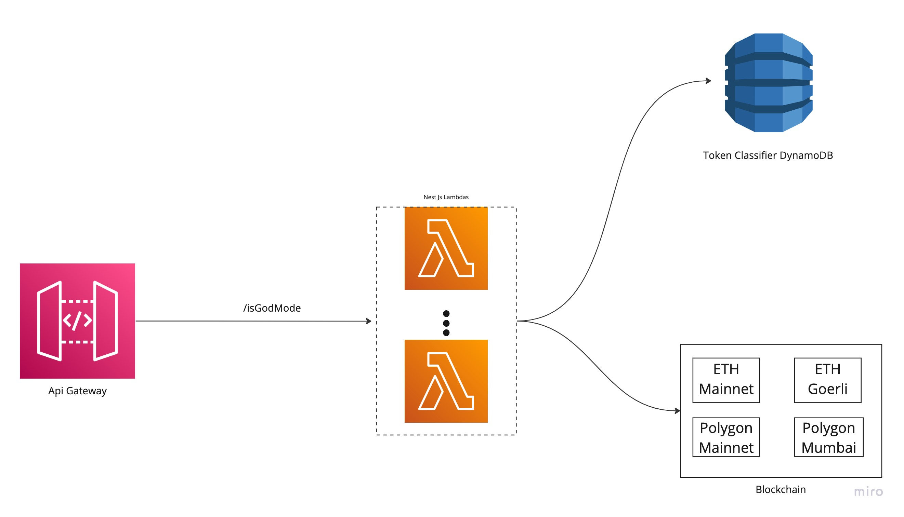

## How it works
- I have used a serverless architecture and nest js to build this application. I have also used CDK (Infra As a Code) to reliably deploy the application to AWS.
- The application consist of an ApiGateway, Lambda which is using the nest.js and dynamodb to store the classification rules and a blockchain provider to support the Ethereum Mainnet, Goerli, Polygon Mainnet and Polygon Mumbai. Other evm based systems are not currently supported.
- Below is an architecture diagram of the project:


- The api gateway proxies the request to the nest.js app that is hosted in the AWS lambda.
- Currently only /isGodMode path is available
- This takes in a network and address as query parameters which is then validated.
- It then makes a call to get all the token classification rules based on the network and lastly, it makes a call to the blockchain to retrieve the token balance.
- If the token is not in the wallet or not listed as a part of the classification rules, it is not included in the response 
- Example response:
```
[
    {
        "network": "Ethereum Mainnet",
        "ABI": "ETH",
        "token": "0x",
        "classification": "NotGodMode",
        "threshold": "1",
        "balance": "0.041190352851039866"
    },
    {
        "network": "Ethereum Mainnet",
        "ABI": "ERC-20",
        "token": "0xB8c77482e45F1F44dE1745F52C74426C631bDD52",
        "classification": "NotGodMode",
        "threshold": "500",
        "balance": "0.079041975039794047"
    }
]
```

- At the moment the classification rules needs to be loaded to dynamodb manually trough the AWS console.In the future, there will be an idempotent API behind this to configure these rules.

### Why serverless with NestJs
- Nest.js provides a good application architecture that allows us to easily test, scale and maintain the application. The serverless architecture with Lambdas allow us to build a scalable solution out of the box and also save you the costs. 
- Using CDK allows you easily and quickly deploy your application with a single command.

### How to setup the Classification
- The classification rules are currently stored in dynamoDB.
- The are manually added to dynamoDB
- Below is the example:
```
{
 "PK": "Ethereum Mainnet", <- Network as Primary Key
 "SK": "0xB8c77482e45F1F44dE1745F52C74426C631bDD52", <- Token Contract address as sort key
 "threshold": "500",
 "tokenType": "ERC-20"
}
```
- If you would like to add a native token such as eth, the classification should look like:
```
{
 "PK": "Ethereum Mainnet",
 "SK": "0x",
 "threshold": "1",
 "tokenType": "ETH"
}

```


## How to Setup

### How the project works

- The code is written in TypeScript.
- It consist the src directory which has the:
  - Lambda code
  - DynamoDb code to retrieve the classification rules
  - Validation code
  - Blockchain Provider
- It also has the deploy directory
  - This has the AWS infrastructure code using the CDK which will deploy the Graphql,DynamoDb and the 3 lambdas to AWS code.

### How to run it

#### Export the following ENV vars:

- `export REGION="YOUR_AWS_REGION"`;
- `export ACCOUNT_ID="YOUR_AWS_ACCOUNT_ID"`;
- `export EthMainnetApiKey="ALCHEMY_API_KEY_FOR_ETH_MAINNET"`;
- `export EthGoerliApiKey="ALCHEMY_API_KEY_FOR_ETH_GOERLI"`;
- `export PolygonMainnetApiKey="ALCHEMY_API_KEY_FOR_POLYGON"`;
- `export PolygonMumbaiApiKey="ALCHEMY_API_KEY_FOR_POLYGON_MUMBAI"`;

#### Run the following commands

- `npm install`
- `npm run build && npm run deploy
#### Add Classification Rules:
- You will need to head to AWS console and add the classification rules manually.

#### Note:
- This assumes you have aws cli setup and your credentials are set.

### How to access the app:
- The application is hosted currently on AWS under the following url: `https://gv2yclaxu8.execute-api.us-east-1.amazonaws.com/prod/isGodMode` and apiKey :`q94CZIa9BbakylfUAMkMi1GV1YG3ZWyfa8qsYcU5`. Below are some of the example requests:

Example Requests:
```
curl -X GET \
 'https://gv2yclaxu8.execute-api.us-east-1.amazonaws.com/prod/isGodMode?address=0xE73Af8e443bE927f4D53c306F1d12eE13ae1dBFA&network=Polygon%20Mainnet' \
 -H 'cache-control: no-cache' \
 -H 'x-api-key: q94CZIa9BbakylfUAMkMi1GV1YG3ZWyfa8qsYcU5'
```
```
curl -X GET \
 'https://gv2yclaxu8.execute-api.us-east-1.amazonaws.com/prod/isGodMode?address=0x57ec4f7cf36f96cb0bdd8914ac57b9683693b0c0&network=Ethereum%20Mainnet' \
 -H 'cache-control: no-cache' \
 -H 'x-api-key: q94CZIa9BbakylfUAMkMi1GV1YG3ZWyfa8qsYcU5'
```

The rules currently stored are:
```
[
  {
    "Network": "Polygon Mainnet",
    "ContractAddress": "0x5D666F215a85B87Cb042D59662A7ecd2C8Cc44e6", //  Galxe OAT (OAT)
    "Threshold": "1",
    "TokenType": "ERC-721"
  },

  {
    "Network": "Polygon Mainnet",
    "ContractAddress": "0xEcfb24Be40f88D66Bb7A14a4bc7f22bDF6841a93", //  DESK (DESK)
    "Threshold": "100",
    "TokenType": "ERC-20"
  },
  {
    "Network": "Ethereum Mainnet",
    "ContractAddress": "0x477F516db22683e65Df58C2cBA4f5D5859d48424",// SOULS (SOULS)
    "Threshold": "1",
    "TokenType": "ERC-721"
  },

  {
    "Network": "Ethereum Mainnet",
    "ContractAddress": "0xc944E90C64B2c07662A292be6244BDf05Cda44a7", //Graph Token (GRT)
    "Threshold": "1000",
    "TokenType": "ERC-20"
  },

  {
    "Network": "Ethereum Mainnet",
    "ContractAddress": "0x", // No contract address
    "Threshold": "1",
    "TokenType": "ETH"
  },

  {
    "Network": "Ethereum Mainnet",
    "ContractAddress": "0xB8c77482e45F1F44dE1745F52C74426C631bDD52", //BNB
    "Threshold": "500",
    "TokenType": "ERC-20"
  },

  {
    "Network": "Polygon Mainnet",
    "ContractAddress": "0x9f95e17b2668AFE01F8fbD157068b0a4405Cc08D",// Bullieverse
    "Threshold": "1", 
    "TokenType": "ERC-20"
  }
]

```
